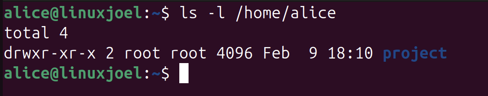
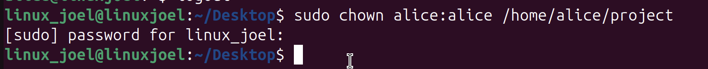
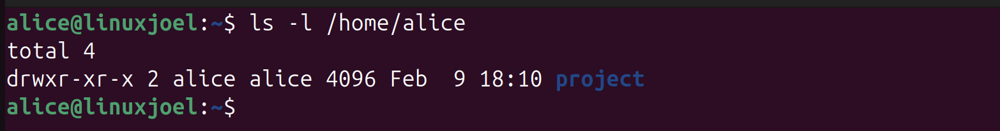
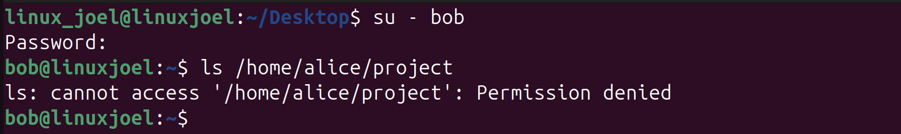

# - Managing Permissions -
### This part of my project is all about permissions within Linux: Linux file ownership, Linux permission system as well as how to control who can access certain files.

## - Set Up -
#### First of all I wanted to create a test folder called "project" that I could use to practice permissions within Linux
```
sudo mkdir /home/alice/project
```
#### I then used what I learnt in my last lab to log into Alice as a user
```
su - alice
```
## - Checking Ownership -
#### Now that I have created a new folder in Alice's home directory I ran the following command to see who currently owned the file
```
ls -l /home/alice
```


#### From running the command I can see that the folder was created by "root" and belongs to the group called "root", however I want to change the ownership into Alice's name.

## - Changing Ownership -
#### in order to change the ownership I will run the following code
```
sudo chown alice:alice /home/alice/project
```


#### To break that last line down
- **sudo** – Run as administrator (root)
- **chown** – Change ownership
- **alice:alice**
  - First alice = user owner
  - Second alice = group owner
- **/home/alice/project** – The target folder

#### After running that command the user owner and user group should be alice. To verify this I will run the same command as before.
```
ls -l /home/alice
```


#### If we compare the two snapshots that were taken from running the ls command we can see that the user and user group were both listed as "root", now they are both listed as "alice"

## - Understanding Linux Permissions -
#### I want to look into the first part of the line "drwxr-xr-x", to someone who is not experienced with the Linux terminal might not understand what these letters represent, to explain this I'm going to dive the string into four parts
```
d | rwx | r-x | r-x
```
#### I will explain what each of these sections represent in a table below
| Section | Meaning                 |
| ------- | ----------------------- |
| d       | directory               |
| rwx     | owner permissions       |
| r-x     | group permissions       |
| r-x     | other users permissions |

#### Now that we know which letters relate to the owner, group and other users I can now explain what each letter means
| Letter  | Meaning               |
| ------- | -------------------   |
| r       | read                  |
| w       | write                 |
| x       | Execute (Enter folder)|

#### With the current permissions we have set up we have
```
rwx r-x r-x
```
#### This means that the owner (Alice) has all permissions, whereas the group and other users can only read and execute. But this folder should only be private to Alice so I will change the permissions to show this.

## - Changing Permissions -
#### I will use the "chmod" command to change the permissions
```
chmod 700 /home/alice/project
```
#### What does the 700 represent? Linux permissions can be written as numbers:
| Number | Meaning   |
|-------|-----------|
| 7     | rwx       |
| 6     | rw-       |
| 5     | r-x       |
| 4     | r--       |
| 0     | no access |

#### As we know the the permissions are sectioned off for the owner, user group and others, we can assign the different permissions using a three digit number
#### chmod XYZ

- **X = owner**
- **Y = group**
- **Z = others**

#### by using chmod 700 I'm making the following changes to the permissions

| Owner   | Group   | Others |
|--------|--------|--------|
| 7 = rwx | 0 = --- | 0 = --- |


#### The result of these changes means that only Alice can:

- Open   
- Read   
- Modify  

#### Nobody else can access it.

## - Verifying the new permissions -
#### After running the following commands
```
chmod 700 /home/alice/project
ls -l /home/alice
```
#### I can see the following output


```
d rwx --- ---
```
#### The output has verified that the owner has full access while the group and others have no access.

## - Testing Permissions -
#### With the following permissions I have set up for Alice's "Project" folder Bob theoretically should not be able to write, read or execute it. I will now log as Bob to test this.



#### as can be seen, Bob does not have permission.

## - Summary -
#### From this task I have learnt the following: 
- Creating directories  
- Understanding Linux ownership  
- Changing ownership with chown  
- Understanding permission strings  
- Restricting access with chmod  
- Verifying with ls -l


