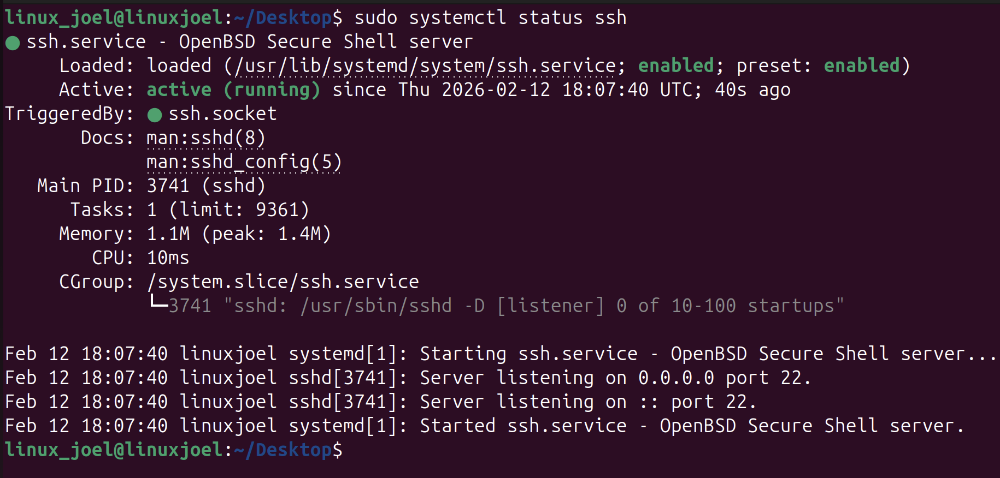
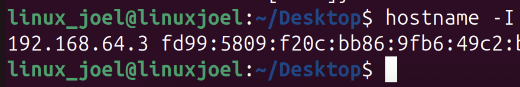
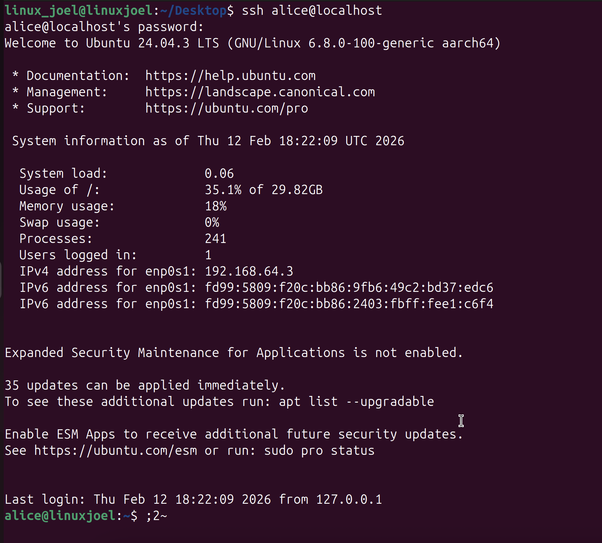
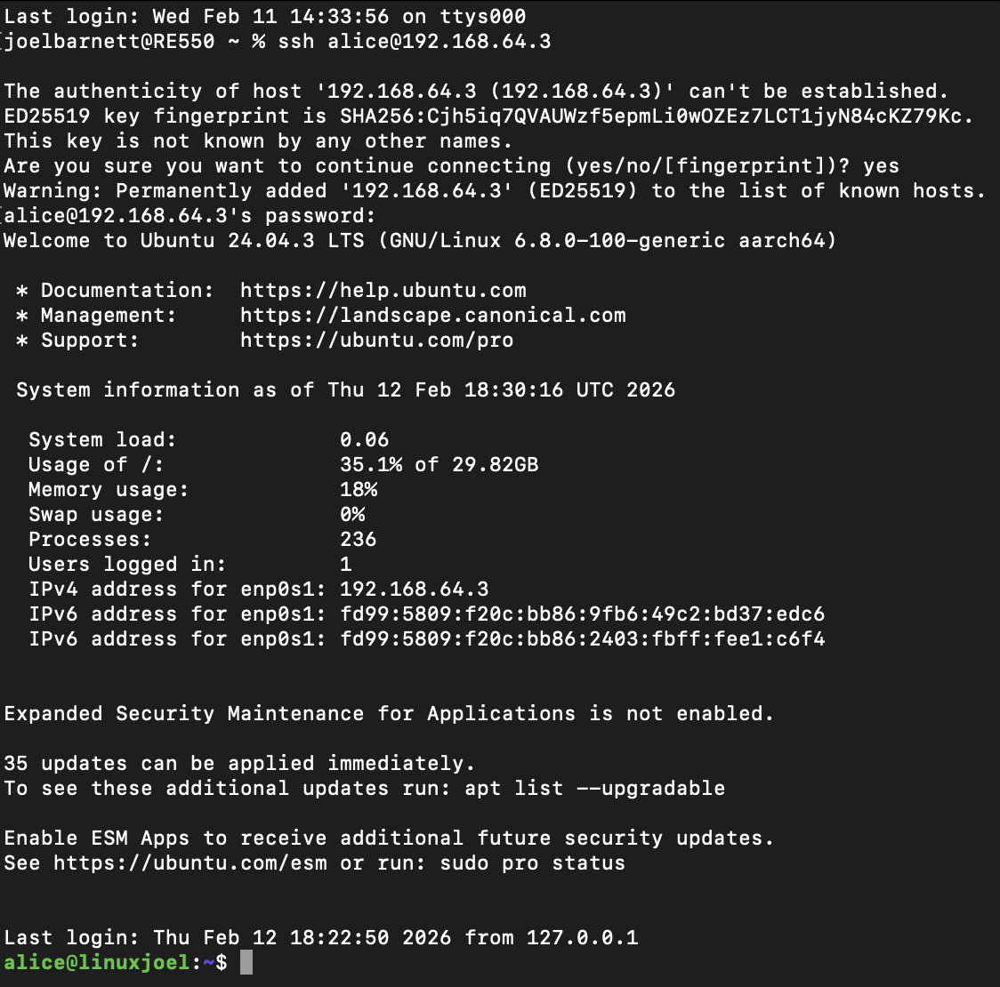

## Using SSH with Linux
#### The goal of this session is to:
- Enable remote access to a Linux machine
- Connect to it securely from another computer
- Understand how SSH works

## what is SSH?
#### SSH = Secure Shell
#### SSH allows you to remotely log into a Linux machine using the command line, it's important to understand SSH has almost all real-world servers are managed through SSH
#### learning SSH is essential for:
- System administration
- Penetration testing
- Network security
- Cloud environments

## Set up
#### First of all I need to run the following commands to install the SSH service
```
sudo apt update
sudo apt install openssh-server -y
```
- "apt install" will refresh the list of available software 
- "sudo apt install openssh-server -y" will install the SSH service, (-y will answer yes automatically)

## Checking that SSH is running
#### To check that SSH is running I will use the following command
```
sudo systemctl status ssh
```


#### As we can see from the screenshot, SSH is active and running.

## Finding the IP of my VM
#### In order to connect to my VM using SSH I will need to know it's IP address, To find this I ran the following
```
hostname -I
```


## Testing SSH from inside the VM
#### I used the command below to log into the same machine using SSH, I had to enter Alice's password and then I was able to log in
```
ssh alice@localhost
```


## Connecting via the Host Machine
#### I will now connect to my VM via my Mac's terminal using the following command
```
ssh alice@192.168.64.3
```

#### As can be seen, I was able to successfully log into my VM via my host machine's terminal.

## Summary
#### I now understand how to do the following
- Install an SSH server  
- Manage Linux services  
- Find IP addresses  
- Connect remotely  
- Troubleshoot connections  
- Use SSH like real administrators 
