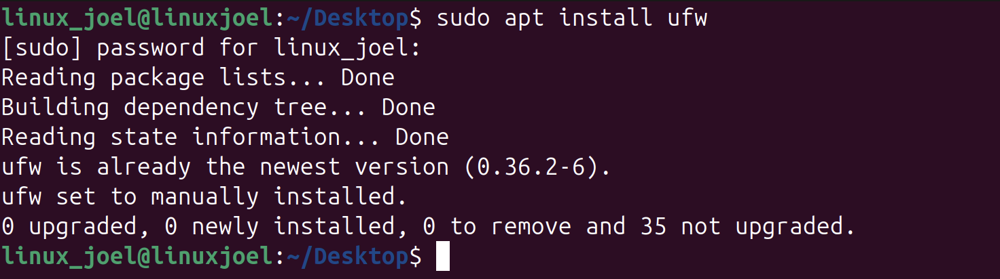

# - Configuring a Firewall -

## - Objectives -
- Control which network traffic is allowed into my VM
- Protect my system
- Understand the basics of network security

## - Installing UFW -
#### To get started I used the following command to install "uncomplicated firewall"
```
sudo apt install ufw
```


## - Checking the status of the current firewall -
#### To check the status I will use the following command
```
sudo ufw status
```
#### As can been see by the screenshot, the current status of the firewall is that it is inactive


#### This means that there are not any firewall rules enforced.

## - Allowing SSH -
#### Before setting up my firewall I need to ensure that I allow SSH as without doing so I could lock myself out of the VM, to do this I will run the following Command.
```
sudo ufw allow ssh
```


#### This will automatically open port 22 which allows SSH, without this SSH would be blocked

## - Allowing Web Traffic -
#### Now that we have SSH allowed I will now set up the firewall so that it will allow HTTP web traffic, I will do this by opening up port 80.
```
sudo ufw allow 80
```


#### Without opening port 80 the firewall would automatically block web traffic.

## - Enabling the firewall -
#### Now that I have set up SSH and Web traffic I will turn on the fire wall with the following command
```
sudo ufw enable
```


## - Checking the rules -
#### Now that I have the firewall enabled I can use the following command to see which rules I have set up.
```
sudo ufw status verbose
```

#### As can be seen from the capture SSH and Web Traffic is allow while everything else is blocked

## - Security in action -
#### Currently I have SSH allowed with my firewall, if I run the following command I will be able to SSH into alice
```
ssh alice@localhost
```


#### If I now run the following command to remove SSH then it should fail when I try to access the VM from my Mac's terminal
```
sudo ufw delete allow ssh
```


#### Doing this test ensured that my firewall was configured correctly to allow and then deny SSH with the rules I set up.

