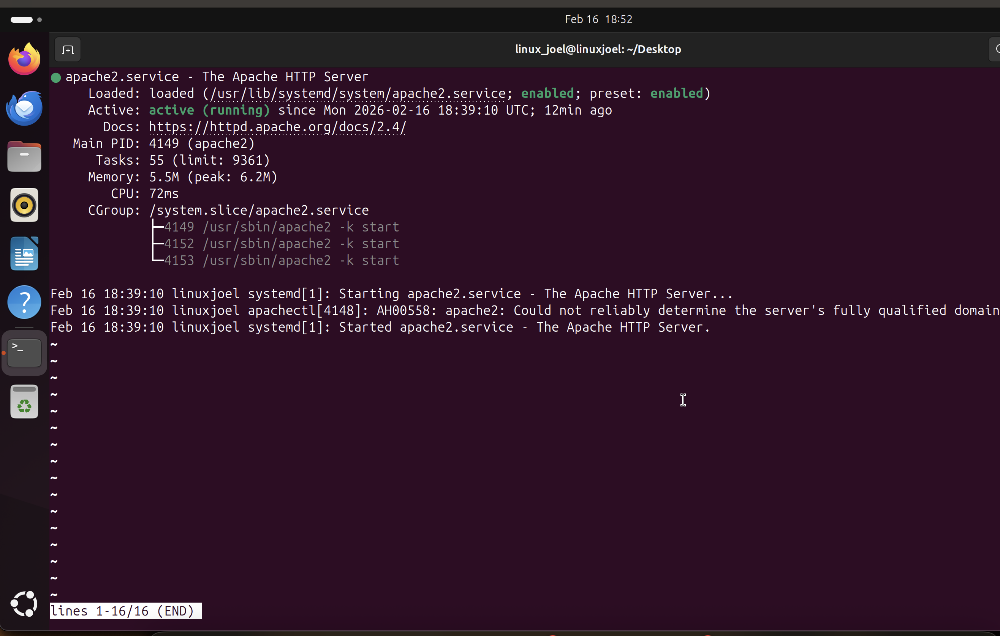
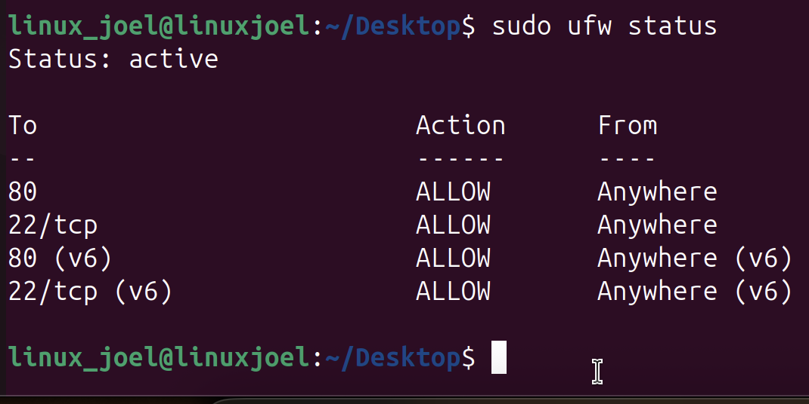
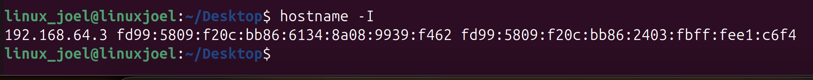
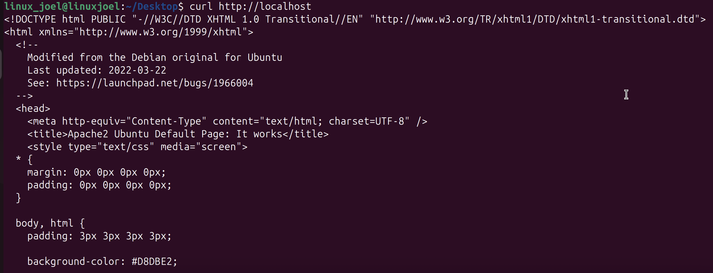
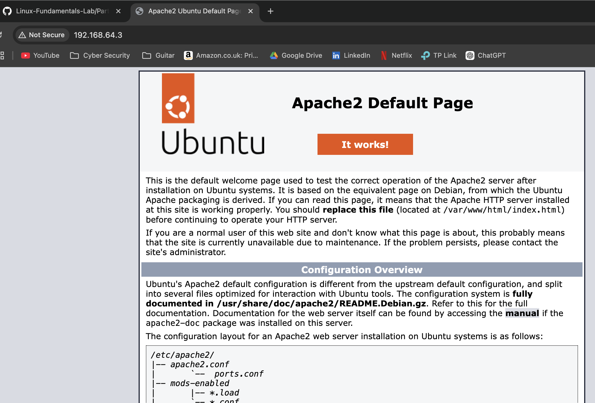
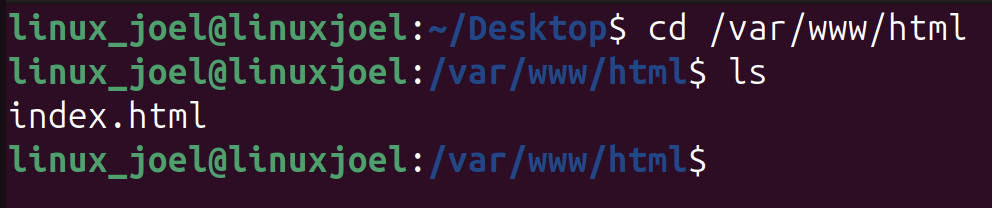
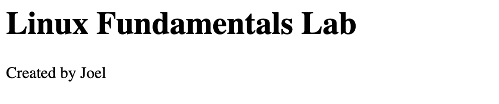
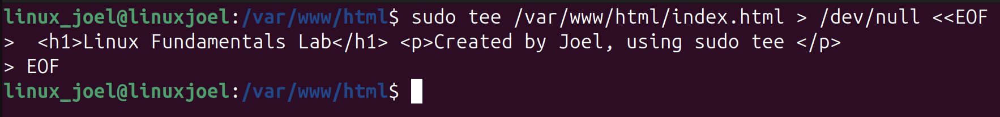
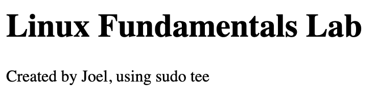

# - Running a Basic Web Server -

## - Objectives -
#### During this lab I will:
- install Apache
- start  a web server
- allow web traffic through the firewall
- Access my site from my Mac's browser
- grow my understanding of running web servers on Linux

## - Installing Apache -
#### To begin I need to install Apache onto my VM using the following commands
```
sudo apt update
sudo apt install apache2 -y
```
## - Checking Apache Status - 
#### Now that Apache has been installed onto my VM I will run the following command to see it's status
```
sudo systemctl status apache2
```


#### As can be seen from the screenshot I captured, Apache is active and running, I can now move onto the next step

## - Allowing Web Traffic Through the Firewall -
#### As I did this in my last lab all I need to do is to run the following command to ensure my firewall rules are still in place
```
sudo ufw status
```


#### With my current rules in place you can see that traffic can be allowed through port 80.

## - Finding my VM's IP address -
#### To find out the IP address of my VM I will run the following command
```
hostname -I
```


## - Testing Locally - 
#### Now that I have the IP address of my VM I will run the following command to see if Apache is working
```
curl http://localhost
```


#### This test has verified that the server is up and running as we got an output of HTML code

## - Testing Externally -
#### I know now that the apache web server is running as intended, I will now attempt to connect to it from my Mac's web browser using the following URL.
```
http://192.168.64.3
```
 

#### The external test is completed as the from my Mac's web browser I can see Apache's default page, this means that the following is true:

- Apache is running
- Firewall allows port 80
- Network is configured correctly

#### Below is a flowchart which shows the process that occured when I completed my external test.

My Mac  
⬇  
Sent HTTP request to 192.168.64.3:80  
⬇  
Firewall checked rules  
⬇  
Allowed traffic  
⬇  
Apache responded  
⬇  
Browser displayed page  

## - Editing the Web Page -
#### To be able to edit my Web page I first need to change into the directory in which it is stored, I will do this with the following command
```
cd /var/www/html
ls
```

#### now that I'm in the correct directory I can use the following command to edit the web page to my liking
```
sudo nano index.html
```
#### This then opens the editor where I have to manually delete the current content and replace it with this
```
<h1>Linux Fundamentals Lab</h1>
<p>Created by Joel</p>
```
 

#### As can be seen, the edit was successful but it took a lot of time, a simpler way to edit the web page is to use the "sudo tee" command
```
sudo tee /var/www/html/index.html > /dev/null <<EOF

<h1>Linux Fundamentals Lab</h1>
<p>Created by Joel, using sudo tee</p>

EOF
```
 
 

#### As can be seen from the image, the edit using "sudo tee" was a success


